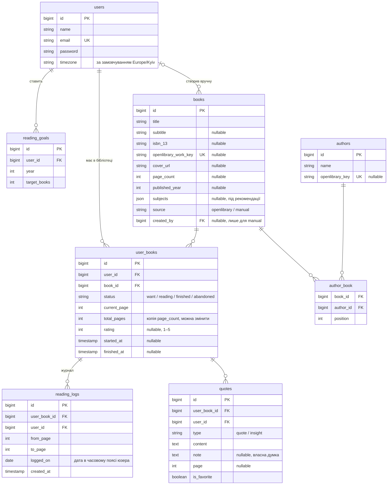

# Bookshelf — бачення і план MVP

> Живий документ: змінюємо, коли змінюються рішення.

## 1. Бачення

Мінімалістичний трекер особистої бібліотеки для телефона. Книгу додаєш за 10 секунд, сторінку оновлюєш за 2, цитату зберігаєш одним дотиком і бачиш, як просувається читання. Без стрічок, лайків і шуму. Під капотом при цьому нормальна інженерія: API-first, тести, CI, Docker, деплой.

## 2. Обсяг MVP

### Входить

- Реєстрація і вхід (email + пароль), ізоляція даних між користувачами
- Бібліотека: книга з Open Library або вручну; статуси «хочу» / «читаю» / «прочитано» / «відкладено»; оцінка 1–5
- Прогрес: швидке оновлення поточної сторінки, прогрес-бари, журнал читання
- Цитати та інсайти з прив'язкою до книги й сторінки, улюблені, картинка-картка для поширення
- Статистика: сторінки по днях, серія днів поспіль, темп, прогноз завершення книги
- Річна ціль «N книг за рік» з індикатором «встигаю / відстаю»
- PWA: встановлюється на телефон, кешує оболонку застосунку
- Тести, CI, Docker, деплой

### Definition of Done

Користувач з телефона реєструється, знаходить книгу в Open Library (або вносить вручну), веде прогрес, зберігає цитати й ділиться карткою, бачить статистику і річну ціль. Застосунок встановлюється як PWA, задеплоєний, CI зелений.

### Не входить (backlog після MVP)

Найближчі невеликі фічі:

- Сканер ISBN камерою
- Офлайн-оновлення прогресу з подальшою синхронізацією
- Повнотекстовий пошук (FULLTEXT-індекс MySQL) і теги для цитат
- Експорт цитат у Markdown
- Вхід через Google
- Перечитування (кілька проходів однієї книги)

Великі напрями:

- **Соцмережа**: публічні профілі, спільні цитати, відгуки, стрічка друзів
- **AI-рекомендації**: на основі оцінок, жанрів і цитат користувача
- **Читанка**: завантаження EPUB і читання в застосунку. Прогрес там рахується за позицією в тексті, а не за сторінками, тож це окремий модуль

Що вже в MVP заклали під ці напрями:

- API-first: соцфічі чи нативний застосунок підключаються до того самого API
- `books` — спільний каталог, тож «хто ще читає цю книгу» і рекомендації будуються поверх нього
- `books.subjects` (жанри/теми з Open Library) зберігаємо вже зараз: це вхідні дані для рекомендацій
- Цитати мають власника і книгу, тож поле `visibility` для соцмережі додається однією міграцією

## 3. Архітектура і стек

```
Телефон / браузер ──► nginx ──┬── /       → Vue SPA (статика, PWA)
                              └── /api/*  → Laravel (php-fpm) ──► MySQL
                                                  │
                                                  └──► Open Library API (з кешем)
```

| Шар | Вибір | Чому |
|---|---|---|
| Бекенд | Laravel (актуальна стабільна), PHP 8.4 | вимога команди |
| API | REST JSON: API Resources, Form Requests | чіткий контракт між фронтом і беком |
| Документація API | Scramble (OpenAPI генерується з коду) | контракт без ручного написання; згодиться для лаб |
| Автентифікація | Sanctum (SPA, cookie + CSRF) + Fortify (headless) | безпечніше за токени в localStorage; Fortify дає реєстрацію, вхід, скидання пароля. Сесія довга, щоб PWA не просила вхід щоразу |
| БД | MySQL 8.4 LTS, `utf8mb4` / `utf8mb4_0900_ai_ci` | команді знайоміший; JSON-колонки і FULLTEXT-індекс на майбутнє; `CHECK`-обмеження працюють з 8.0.16 |
| Фронт | Vue 3 + TypeScript + Vite | команда знає Vue; добре стикується з Laravel |
| Стан | Pinia (сесія, бібліотека, UI) | оптимістичні оновлення прогресу з чергою запитів зроблені в сторі без зайвої залежності. TanStack Query свідомо не підключали; повернемось до цього, якщо офлайн-режим (етап 5) покаже, що кеш потрібен |
| Стилі | Tailwind CSS | швидко, mobile-first |
| PWA | vite-plugin-pwa (Workbox) | маніфест, service worker, встановлення |
| Графіки | Chart.js (vue-chartjs) | легкий і його вистачає |
| Картка цитати | html-to-image + Web Share API | PNG генерується на клієнті, на телефоні відкривається нативне «Поділитися» |
| i18n | vue-i18n (інтерфейс українською) | англійську можна додати без переписування |
| Типи API | openapi-typescript (з OpenAPI від Scramble) | зміни контракту фронт ловить уже при компіляції |
| Тести | Pest (бек), Vitest (фронт) | Playwright для E2E — після MVP |
| Якість коду | Pint, Larastan; ESLint, vue-tsc | — |
| Інфраструктура | Docker Compose, GitHub Actions | CI на кожен PR, CD з `main` |

### Чому окремі SPA + API, а не Inertia

- PWA і офлайн природніше лягають на SPA, яка бере дані з API
- Соцмережа, читанка, можливий нативний застосунок стануть новими клієнтами того самого API
- Бек і фронт працюють паралельно за контрактом OpenAPI
- Для «Конструювання ПЗ» шари чітко розділені, їх легко описати в лабах

Усі бекенд-маршрути, включно з автентифікацією і `csrf-cookie`, живуть під `/api`, щоб не конфліктувати з маршрутами SPA (`/login` тощо).

### Шари бекенду

`Controller → FormRequest (валідація) → Action/Service (доменна логіка) → Model`, доступ перевіряють Policies. Доменна логіка (переходи статусів, оновлення прогресу, статистика) живе в Actions/Services, а не в контролерах, і покривається unit-тестами.

## 4. Модель даних



Примітки:

- Унікальні індекси: `user_books (user_id, book_id)`, `reading_goals (user_id, year)`, `books.openlibrary_work_key`
- `user_id` у `reading_logs` і `quotes` денормалізовано, щоб спростити скоупінг і запити статистики
- `total_pages` лежить у `user_books`, а не лише в `books`: видання бувають різні, а каталог спільний, тож кожен виправляє число під своє
- Ручні книги (`source = manual`) бачить лише їхній автор. Книги з Open Library утворюють спільний каталог, і його поля користувачі не редагують
- Видалення `user_books` каскадно видаляє журнал і цитати
- Статуси — PHP enum, у БД зберігаються рядком

## 5. Бізнес-правила

### Статуси

| Перехід | Що відбувається |
|---|---|
| want → reading | `started_at = now()`; обов'язково має бути `total_pages` |
| reading → finished | `finished_at = now()`, `current_page = total_pages` |
| reading → abandoned | прогрес зберігається |
| abandoned → reading | продовжуємо з тієї ж сторінки |
| want → finished | книга прочитана раніше: дати можна вказати вручну, журнал не створюється |
| finished → reading | виправлення помилки: `finished_at` очищується. Повноцінне перечитування — у backlog |

### Оновлення прогресу

- Нова сторінка — ціле число від 0 до `total_pages`
- Книга в статусі want чи abandoned автоматично переходить у reading. Для finished оновлення заборонене
- Кожне оновлення створює запис у `reading_logs` (`from_page` → `to_page`, `logged_on` = сьогодні в часовому поясі юзера)
- Коли користувач дійшов до `total_pages`, застосунок пропонує позначити книгу прочитаною (сам статус не змінює)
- Помилки введення (300 замість 30, потім виправлення) дають у журналі від'ємну дельту. Денна статистика рахує чисту суму за день, тож помилка не роздуває цифри
- Перехід reading → finished з сторінки, меншої за `total_pages`, записує в журнал і решту сторінок (вони прочитані). Для want → finished журнал не створюється
- Оновлення, яке не змінює сторінку, нічого не пише й не змінює статус
- Якщо нове `total_pages` менше за `current_page`, це помилка валідації

### Ізоляція даних

- Усі `user_books`, `quotes`, `reading_logs`, `reading_goals` належать користувачу, доступ перевіряють Policies
- На запит до чужого ресурсу повертаємо 404, щоб не підтверджувати, що такий ресурс існує
- Кожен ендпоінт має тест «юзер Б не бачить і не змінює дані юзера А»

## 6. Статистика: як рахуємо

Усе рахується в часовому поясі користувача.

| Метрика | Визначення |
|---|---|
| Сторінки за день | сума `to_page − from_page` за `logged_on`, не менше 0 |
| Серія (streak) | кількість днів поспіль, коли прочитано більше 0 сторінок; серія закінчується сьогодні або вчора, тож зранку вона ще не обнулилася |
| Темп | середня кількість сторінок на день за останні 14 днів (дні без читання теж рахуються) |
| Прогноз по книзі | `(total_pages − current_page) / темп цієї книги`; якщо даних мало, береться загальний темп |
| Річна ціль | кількість книг із `finished_at` у поточному році порівняно з `target_books` |
| «Встигаю?» | прочитано ≥ `target_books × (день року / днів у році)` |

## 7. API (чернетка)

Усе під `/api`, формат JSON, автентифікація cookie-сесією Sanctum.

| Метод | Шлях | Що робить |
|---|---|---|
| POST | `/api/auth/register`, `/api/auth/login`, `/api/auth/logout` | Fortify |
| GET / PATCH | `/api/me` | поточний юзер; змінити ім'я та часовий пояс |
| GET | `/api/catalog/search?q=` | пошук в Open Library через наш бекенд |
| GET | `/api/library?status=` | моя бібліотека |
| POST | `/api/library` | додати книгу: `{openlibrary_work_key}` або ручні дані |
| GET / PATCH / DELETE | `/api/library/{userBook}` | деталі; зміна статусу, оцінки, `total_pages`; видалення |
| POST | `/api/library/{userBook}/progress` | `{page}`: оновити прогрес |
| GET | `/api/library/{userBook}/logs` | журнал читання книги |
| GET | `/api/quotes?favorite=&book=` | мої цитати |
| GET | `/api/quotes/random?favorite=1` | цитата дня |
| POST | `/api/library/{userBook}/quotes` | нова цитата |
| PATCH / DELETE | `/api/quotes/{quote}` | редагувати, позначити улюбленою, видалити |
| GET | `/api/stats/summary` | серія, темп, підсумки за рік і місяць |
| GET | `/api/stats/daily?from=&to=` | сторінки по днях для графіка |
| GET / PUT | `/api/goals/{year}` | річна ціль |

### Open Library

- Фронт не звертається до Open Library напряму, лише через `/api/catalog/search`
- Бекенд нормалізує відповідь (назва, автори, обкладинка, сторінки, рік, subjects), кешує її на 24 год і обмежує частоту запитів (throttle на користувача)
- У запитах передаємо User-Agent з назвою застосунку і контактом, як просить Open Library
- Під час додавання книга копіюється в наш каталог; дублікати відсіюються за `openlibrary_work_key`
- Якщо Open Library недоступна або нічого не знайшла, фронт пропонує ввести книгу вручну. Українських видань там мало, тож ручне введення — повноцінний сценарій
- У тестах використовуємо `Http::fake()`, реальних запитів немає

## 8. Екрани PWA

Нижній таб-бар: **Читаю · Бібліотека · Цитати · Статистика**. Профіль відкривається іконкою в шапці.

| Екран | Що на ньому |
|---|---|
| Вхід / реєстрація | email + пароль |
| Читаю (головна) | картки поточних книг із прогрес-баром; «Я на сторінці…», `+10` / `+25`; відгук після оновлення («+18 сторінок, 🔥 5 днів»); цитата дня |
| Бібліотека | вкладки за статусами; «Додати» відкриває пошук в Open Library з автокомплітом або ручну форму |
| Книга | обкладинка, прогрес, статус, оцінка, історія читання, цитати цієї книги |
| Цитати | список; фільтри «улюблені» і за книгою; додавання; «Поділитися карткою» |
| Картка цитати | 2–3 шаблони оформлення → PNG → нативне «Поділитися» (на десктопі — завантаження файлу) |
| Статистика | річна ціль, графік сторінок по днях, серія, темп, прогнози по книгах |
| Профіль | ім'я, часовий пояс, вихід |

Принципи: mobile-first, великі зони натискання, прогрес оновлюється за 1–2 дотики. Оновлення оптимістичні: інтерфейс реагує одразу, а запит іде у фоні.

## 9. Якість та інфраструктура

### Структура репозиторію (монорепо)

```
bookshelf/
├── backend/            Laravel API
├── frontend/           Vue PWA
├── docker/             Dockerfile-и, конфіг nginx
├── docs/               цей план, рішення, згодом — матеріали для лаб
├── docker-compose.yml  локальна розробка однією командою
└── .github/workflows/  CI/CD
```

### Тести

- Бекенд (Pest): feature-тести на кожен ендпоінт, включно з ізоляцією; unit-тести на переходи статусів, оновлення прогресу і статистику
- Фронт (Vitest): швидке оновлення прогресу, форматування статистики, ключові компоненти
- E2E (Playwright) — після MVP

### CI (GitHub Actions, на кожен PR)

- backend: Pint → Larastan → Pest (MySQL у сервісному контейнері)
- frontend: ESLint → vue-tsc → Vitest → build
- Зміни потрапляють у `main` тільки через PR і тільки із зеленим CI

### Docker

- dev: `docker compose up` піднімає nginx, php-fpm, MySQL і Vite з hot reload
- prod: multi-stage образи (зібраний фронт як статика в nginx; php-fpm з оптимізованим автолоадом)

### Деплой (CD)

Пуш у `main` → збірка образів → деплой на VPS (кредити GitHub Student Developer Pack). Перший живий деплой — одразу після етапу 1, далі деплоїться кожен мерж.

## 10. Етапи

| # | Етап | Результат |
|---|---|---|
| 0 | Каркас | монорепо, Docker, порожні Laravel і Vue, зелений CI, працюють реєстрація і вхід |
| 1 | Бібліотека | каталог, автори, додавання з Open Library і вручну, статуси, список за статусами; **перший деплой** |
| 2 | Прогрес | оновлення сторінки, журнал, прогрес-бари, головний екран «Читаю» |
| 3 | Цитати | CRUD, улюблені, цитата дня, картка-картинка |
| 4 | Статистика і ціль | метрики з розділу 6, графіки, річна ціль |
| 5 | PWA і шліфування | маніфест, встановлення, кешування, порожні стани, обробка помилок, перевірка на реальних телефонах |

Бек і фронт кожного етапу йдуть паралельно: спершу фіксуємо ендпоінти (OpenAPI), потім кожен робить свою частину.

### Статус етапу 2 (прогрес): виконано

Що є: `POST /api/library/{userBook}/progress` (`{page}`) і `GET /api/library/{userBook}/logs`, таблиця `reading_logs` з `CHECK (from_page <> to_page)`,
головний екран «Читаю» з картками (`+10`, `+25`, «Я на сторінці…», підказка «+18 стор.», пропозиція позначити прочитаною на останній сторінці),
форма сторінки й історія читання на екрані книги. Помилки правил: `library.progress_finished`, `library.page_above_total`.
Бекенд: 162 тести, фронтенд: 90 тестів.

Рішення й відхилення:
- Відповідь на прогрес містить `meta.pages` (скільки сторінок це дало, від'ємне для виправлення) і `meta.reached_end`. «Серія днів» у відгуку з'явиться в етапі 4, коли буде статистика.
- Оптимістичне оновлення живе в Pinia-сторі: книга в статусі «Читаю» показує нову сторінку одразу, запити однієї книги йдуть по черзі (другий тап будується на першому), а при відмові сервера показується справжній стан. Для want і abandoned чекаємо відповіді, бо змінюється статус. Картка не стрибає вгору списку під пальцем; порядок за активністю оновиться при наступному завантаженні.
- Рядок книги блокується в БД на час оновлення (`lockForUpdate`), тож два швидкі запити не читають одну й ту саму стартову сторінку.
- Власність перевіряється до валідації тіла (в `UpdateProgressRequest` і `UpdateUserBookRequest`): чужий запис завжди 404, навіть якщо тіло некоректне. Раніше `PATCH` чужого запису з поганим тілом давав 422.
- `logged_on` рахується в часовому поясі читача, а не сервера (є тест: 22:30 UTC це вже наступний день у Києві).
- Список журналу посторінковий (20 записів, «Показати ще»).

### Статус етапу 1 (бібліотека): код і конфігурація деплою готові, чекаємо на сервер

Що є: спільний каталог книг і авторів, бібліотека читача зі статусами й переходами за таблицею вище (сервер віддає
`allowed_statuses`, тож клієнт не дублює правила), пошук в Open Library через бекенд (кеш 24 години, 30 запитів на хвилину,
ручне додавання як запасний шлях), оцінка 1-5, зміна кількості сторінок, видалення, екрани «Читаю», «Бібліотека»,
«Додати книгу», «Книга», «Профіль». Помилки бізнес-правил API повертає стабільними кодами (`library.*`, `catalog.*`),
які фронтенд перекладає українською. Бекенд: 121 тест, фронтенд: 54 тести.

Відхилення й рішення:
- TanStack Query не підключали: серверний стан бібліотеки лежить у Pinia. На етапі 2 оптимістичні оновлення теж зробили в сторі, залежність не знадобилась.
- Дати «прочитано раніше» бекенд уже приймає (`started_at`, `finished_at`), але в інтерфейсі їх поки немає: кнопка «Вже прочитана» ставить дату завершення на сьогодні.
- Реальний Open Library з коду проєкту не викликався (правило безпеки). Формат відповіді звірено з публічною відповіддю API; живу перевірку варто зробити вручну на VPS або локально.
- Деплой підготовлено, але не виконано: продакшн-образи (x64), `deploy/docker-compose.prod.yml` з Caddy, скрипт підготовки сервера,
  бекап бази, jobs `docker`, `images` і `deploy` у CI (вимкнені, доки не задано змінну `DEPLOY_ENABLED`) та інструкція `docs/deploy.md`.
  Локально продакшн-стек перевірено повністю, а GitHub Actions + Azure чекають на створення VM.
- За reverse proxy Laravel довіряє заголовкам `X-Forwarded-*`, інакше ліміт спроб входу рахувався б на адресу проксі, а не клієнта (є тест).

### Статус етапу 0 (каркас): виконано

Що є: монорепо, Docker Compose (nginx, php-fpm, MySQL 8.4, Vite), Laravel 13 на PHP 8.4, Vue 3 + TypeScript + Tailwind,
реєстрація, вхід, вихід і `GET/PATCH /api/me` з часовим поясом, 16 тестів бекенду (Pest) і 12 фронтенду (Vitest),
Pint, Larastan, ESLint, vue-tsc, CI на GitHub Actions. Запуск і команди описані в `README.md`.

Відхилення від початкового плану:
- Застосунок відкривається на `http://localhost:8000`, а не 8080 (8080 часто зайнятий); порт змінюється через `WEB_PORT`.
- Файлу `.env` немає: dev-налаштування лежать у `docker-compose.yml`, CI-налаштування в `ci.yml`.
- TanStack Query, Chart.js, html-to-image, openapi-typescript і vite-plugin-pwa підключимо на тих етапах, де вони вперше потрібні, щоб не тягнути невикористані залежності.
- Продакшн-образи й автоматичний деплой робимо разом з першим деплоєм (етап 1).
- Повідомлення валідації з бекенду англійською; фронтенд поки що перекладає лише відомі помилки входу й реєстрації. Локалізацію бекенду (`uk`) додамо окремим кроком.

## 11. Організаційні рішення

- **Репозиторій:** `git@github.com:SashaCN/Bookshelf.git` (монорепо, CI на GitHub Actions)
- **Хостинг:** VPS від Microsoft Azure for Students (за офіційною сторінкою на 2026-10-04: кредит $100 на 12 місяців без банківської картки, плюс 12 місяців безкоштовно по 750 годин ВМ B1s, B2pts v2 (Arm) і B2ats v2). DigitalOcean у Student Pack більше не значиться. Підписка дозволяє розгортання лише в Austria East, Denmark East, Italy North, Norway East і Switzerland North; B2ats_v2 (x64, 2 vCPU, 1 ГБ RAM, без зони доступності) доступний у Denmark East; усі безкоштовні розміри мають лише 1 ГБ RAM, тому стек налаштований економно. HTTPS через Caddy (безкоштовні сертифікати Let's Encrypt). Домен: безкоштовний на рік від Name.com або Namecheap (.me), або тимчасово hostname на sslip.io. Остаточний вибір VM і домену за користувачем.
- **Як пишемо код:** разом з Claude, без жорсткого поділу на «фронт» і «бек». Великі етапи можна паралелити кількома агентами. Кожну зміну перед мержем переглядає людина з команди
